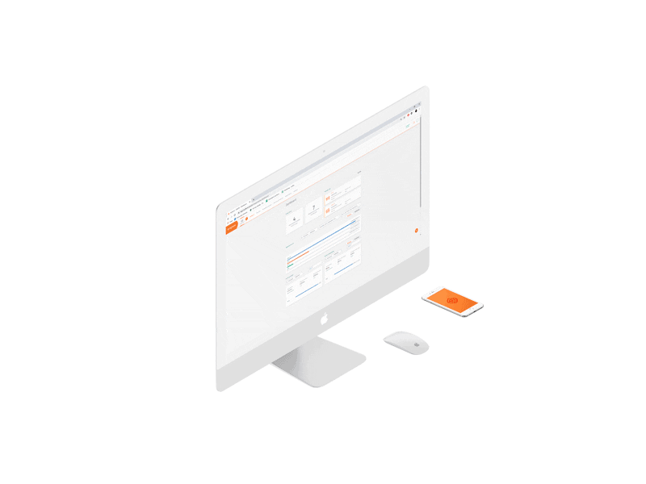

<h1 align="center">
  🚀 Portfólio Front-end
</h1>
<h4 align="center" >
     
  Portfólio de apresentação de conhecimentos e padrões de Desenvolvimento Front-end.
</h4>

## 🗃Arquitetura
**O portfólio é composto por 3 níveis de projetos diferentes, sendo eles:**

**Basic projects:** Composto por projetos mais simples, tanto em estrutura quanto em estilos; Feito apenas para documentar projetos do meu início de estudos em front-end.

Esse diretório não recebera mais atualizações.

**Intermediate projects:** Diretório de projetos menores, com menos complexidade estrutural e visual, feito apenas para tester e exercitar conceitos básicos de html, css, js e scss.

**Advanced project:** Esse diretório é composto por projetos mais detalhados, com layouts modernos, efeitos animados e bibliotecas; Este será meu principal ponto de trabalho, colocando projetos novos e atualizando os atuais.

---

## 💼 Tecnologias utilizadas
Para o desenvolvimento dos sites a seguir, utilizei as seguintes tecnologias:

- **HTML;**
- **CSS;**
- **SCSS;**
- **JavaScript;**
- **Swiper.js**
- **ScrollReveal.js**

---

## 📋 Descrição

Projetos das plataformas **DIO**(Digital Innovation One), **Udemy**, B7Web(Cursos do Bonieky). 

#### ⚙Observação

---

