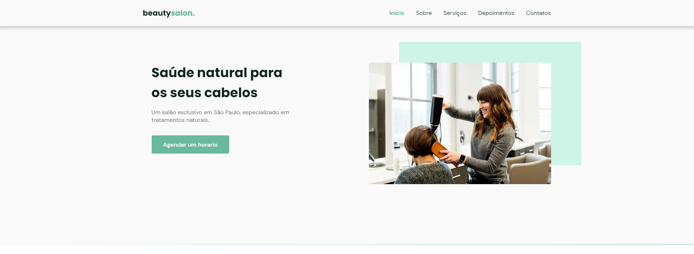
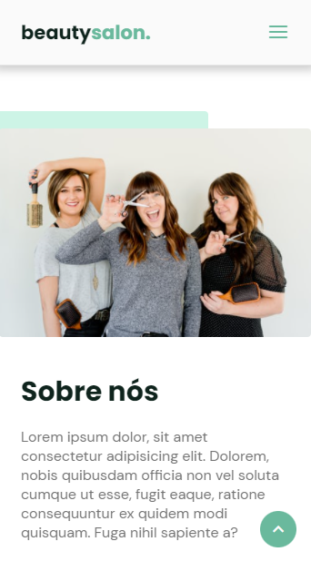

<h1 align="center">
  💻 Projeto
</h1>
<h4 align="center">
  Projeto criado para praticar e elevar conhecimentos e padrões de Desenvolvimento Front-end.
</h4>

## 🔎Preview

    

         
    <b>Link do Site:</b> <a target="_blank" href='https://isaac-mcastanho.github.io/Front-end/advanced-project/BeautySalon/'>BeautySalon</a>
    

<h5>Desktop</h5>

<h5>Mobile</h5>

## 📚 Seções
O site é composto por 5 seções diferentes:

- **Início:** Nele temos uma breve apresentação;
- **Sobre:** Nessa seção tem uma "descrição detalhada" sobre a empresa;
- **Serviços:** Apresenta uma breve descrição de mercado, com cards informativos sobre os serviços;
- **Depoimentos:** Mostra com cards ao estilo publicação, com avaliações de clientes;
- **Contatos:** Seção de informativa, com um botão pro WhatsApp, com informações de e-mail e endereço;

---

## 💼 Tecnologias utilizadas
Para o desenvolvimento deste site utilizei as seguintes tecnologias:

- HTML;
- CSS;
- JavaScript;
- ScrollReveal;
- Swiper;

---

## 📋 Descrição

  Projeto feito na participação do NLW da Rocketseat. 
  Prof: Mayk Brito  
  Projeto com fins educacionais, todas as informações são ilustrativas, com imagens de bancos gratuitos.

---

