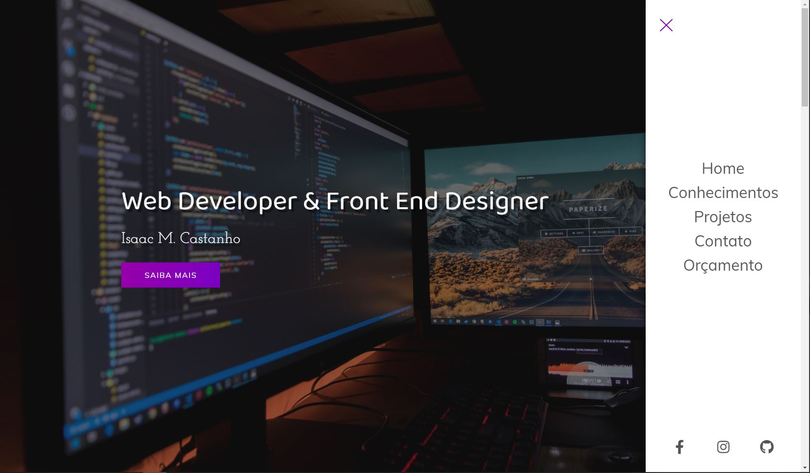
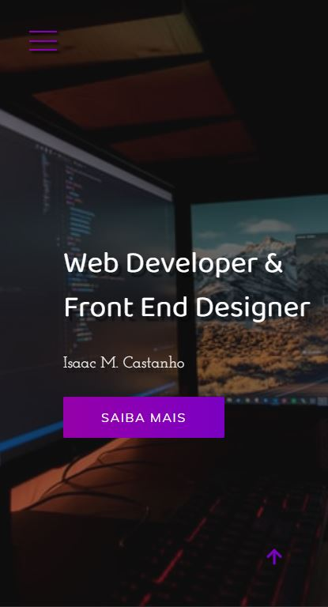

<h1 align="center">
  💻 Projeto
</h1>
<h4 align="center">
  Projeto criado para praticar e elevar conhecimentos e padrões de Desenvolvimento Front-end.
</h4>

## 🔎**Preview**

    

         
    <b>Link do Site:</b> <a target="_blank" href='https://isaac-mcastanho.github.io/Front-end/advanced-project/portfolio-presentation/'>Portfólio - Developer</a>
    

<h5>Desktop</h5>

<h5>Mobile</h5>

---

## 💼 Tecnologias utilizadas
Para o desenvolvimento deste site utilizei as seguintes tecnologias:

- HTML;
- CSS;
- JavaScript;

---

## 📋 Descrição

Referencia do Projeto:<a href="https://www.youtube.com/watch?v=L_JSUkn7LME&list=PLM_90--7SomWgfPYCXnpuoY2L-Z_Z-AiV">Website completo com HTML, CSS e JS #1: Estrutura do Projeto</a>
     

O site consiste em uma landing page simples, apenas para exercitar conceitos de arquitetura CSS e SCSS.

A ideia do site é simular um portifolio de desenvolvedor.

O site tem 5 seções fora o menu lateral e o rodapé.
    Banner inicial;
    Seção de conhecimentos;
    Seção de projetos;
    Seção de contato;
    Seção de orçamento.

#### 🔬Refatoração

​	Já fiz uma refatoração para SCSS, para poder dividir o codigo, e ter uma visão mais organizada;

Tentei trazer a estrutura para algo parecido com o que vemos em uma biblioteca.js como react, simulando uma estrutura de "pages" e "Components";

Ainda sem animações;

Em breve farei uma refatoração mais precisa, trazendo todo o codigo para o ingles, aplicando a arquitetura BEM e padronizando ainda mais o codigo, em forma de "Componentes".

---

