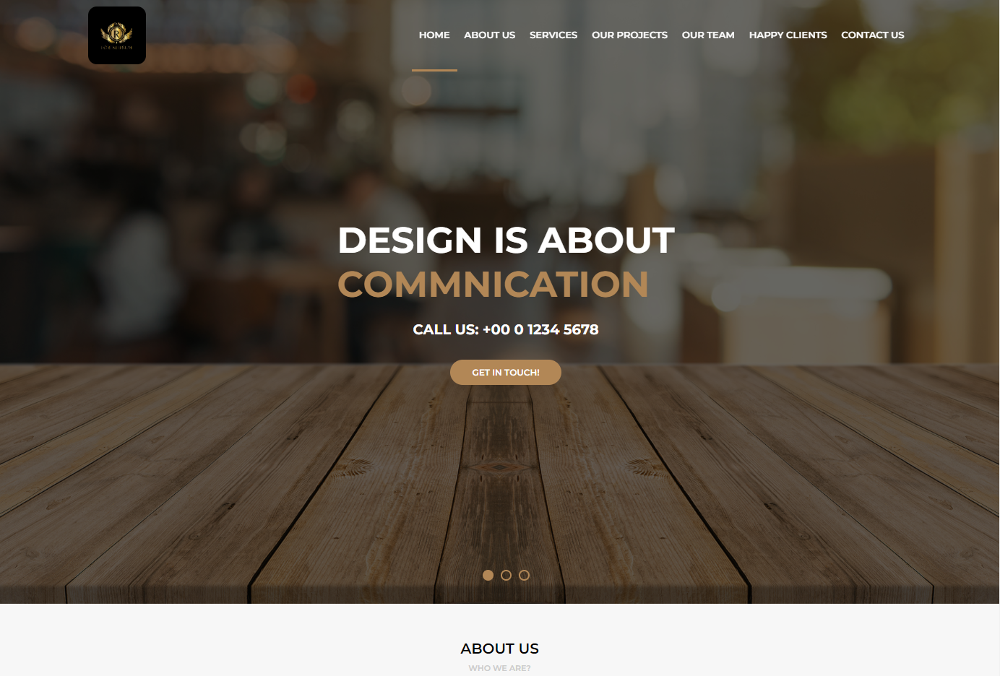
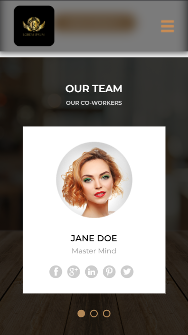

<h1 align="center">
  💻 Projeto
</h1>
<h4 align="center">
  Projeto criado para praticar e elevar conhecimentos e padrões de Desenvolvimento Front-end.
</h4>

## 🔎Preview

    

         
    <b>Link do Site:</b> <a target="_blank" href='https://isaac-mcastanho.github.io/Front-end/advanced-project/site-Awax/home'>Awax</a>
    

<h5>Desktop</h5>

<h5>Mobile</h5>

## 📚 Seções
O site é composto por 7 seções diferentes:

- **Home:** Nele temos uma breve apresentação com banner em slide não funcional;
- **About us:** Nessa seção tem uma "descrição detalhada" sobre a "empresa" com uma imagem ilustrativa;
- **Services:** Apresenta uma breve descrição dos benefícios da "empresa", em forma de "tabela";
- **Our projects:** Mostra com imagens e uma descrição hover animada e um filtro de tema(não funcional), os projetos da empresa;
- **Our team:** Seção de apresentação da equipe e seus contatos pessoais, em forma de cards(slide não funcional);
- **Happy clients:** Seção de depoimentos de clientes;
- **Contact us:** Seção de apresentação de medias de contato e endereço com "mapa" do lugar de fundo;

---

## 💼 Tecnologias utilizadas
Para o desenvolvimento deste site utilizei as seguintes tecnologias:

- HTML;
- CSS;
- JavaScript;

---

## 📋 Descrição

  Projeto feito na participação do curso gratuito da B7Web. 
  Prof: Bonieky Lacerda  
  Projeto com fins educacionais, todas as informações são ilustrativas, com imagens de bancos gratuitos.

#### ⚙Observação

Problemas de responsividade em: Section Happy clients

Conclusão: Erros corrigidos, erro simples (usando medidas absoluta com min-width, estava impedindo a section de se ajustar de  forma natural e responsiva.).

##### Alterações:

**Geral:** Mudança nos botões da pagina, com um efeito hover de scale.

**Header:** Cabeçalho era estatico no inicio do site, passou a ser fixo, com uma animação de background ao descer o scroll.

Mudança do background preto para um design transparente e blur como um vidro fosco.

Função de active no menu de navegação ao dar scroll na pagina, dando direcionamento e facilidade na navegação.

**Our projects:** Alteração do hover da imagem; Com efeito top, opacity e rotate, para a sobreposição da imagem aparecer de forma animada, de baixo para cima.

---

